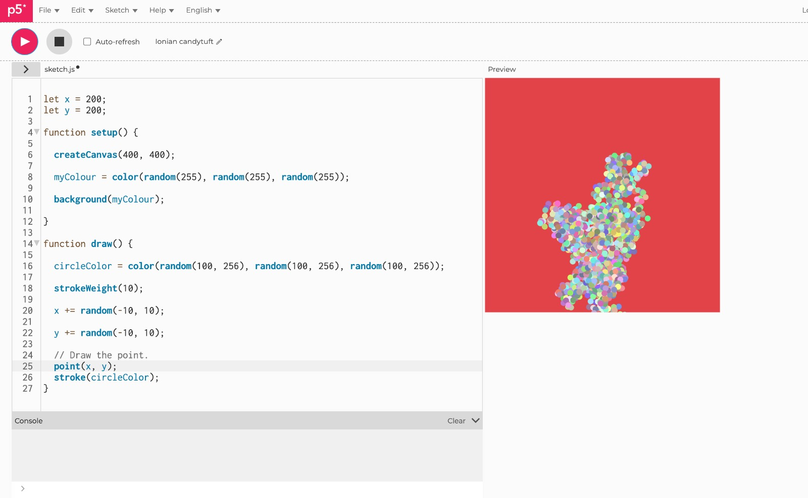

#### Cuadrado p5

Para esta actividad reutilize el codigo del ejercicio 6, donde pasaba algo similar pero con una elipse, se utilizo el mismo codigo en micro:bit , donde se le especifica al codigo si el boton "a" es precionado, este haga un
write de "A", y se repite con B y C (que en este caso seria al agitarlo)

``` js
from microbit import *

uart.init(baudrate=115200)
display.show(Image.BUTTERFLY)

while True:
    if button_a.is_pressed():
        uart.write('A')
        sleep(500)
    if button_b.is_pressed():
        uart.write('B')
        sleep(500)
    if accelerometer.was_gesture('shake'):
        uart.write('C')
        sleep(500)
    if uart.any():
        data = uart.read(1)
        if data:
            if data[0] == ord('h'):
                display.show(Image.HEART)
                sleep(500)
                display.show(Image.HAPPY)

```
dentro de su index.html se le conecta con el codigo 
``` js
<script src="https://unpkg.com/@gohai/p5.webserial@^1/libraries/p5.webserial.js"></script>
```

y se hizo el mismo proceso en P5.js pero con la diferencia que cambiamos la figura de "elipse" por "cuadrado" en este caso "rect", y veremos en la ventana generada el cuadrado y al interactuar con los botones este cambiara
de color
``` js

let port;
let connectBtn;

function setup() {
    createCanvas(400, 400);
    background(220);
    port = createSerial();
    connectBtn = createButton('Connect to micro:bit');
    connectBtn.position(80, 300);
    connectBtn.mousePressed(connectBtnClick);
    let sendBtn = createButton('Send Love');
    sendBtn.position(220, 300);
    sendBtn.mousePressed(sendBtnClick);
    fill('white');
    rect(50, 50, 300, 200); 
}

function draw() {

    if(port.availableBytes() > 0){
        let dataRx = port.read(1);
        if(dataRx == 'A'){
            fill('red');   
        }
        else if(dataRx == 'B'){
            fill('yellow'); 
        }
        else{
            fill('green'); 
        }
        background(220);
       rect(50, 50, 300, 200); 
        fill('black');
        text(dataRx, width / 2, height / 2);
    }    


    if (!port.opened()) {
        connectBtn.html('Connect to micro:bit');
    } 
    else {
        connectBtn.html('Disconnect');
    }
}

function connectBtnClick() {
    if (!port.opened()) {
        port.open('MicroPython', 115200);
    } else {
        port.close();
    }
}

function sendBtnClick() {
    port.write('h');
}

```
y esto nos da como resultado el cuadrado y al interactuar con los botones, este cambia de color


