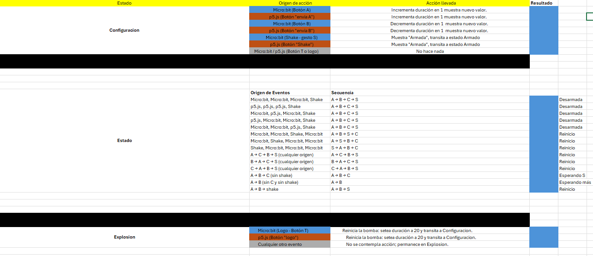

aunque esta prueba tenia mucha similitud a la anterior de la actividad 6 (ya que de cierto modo cumplen las mismas funciones pero de diferente forma),
esta de igual forma se hizo combinacion a combinacion y todo funciona 
